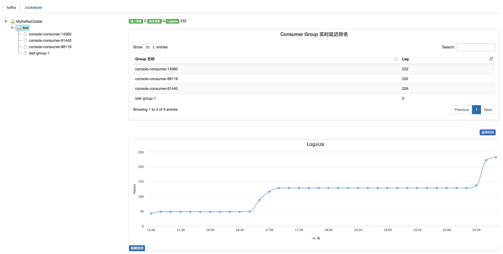
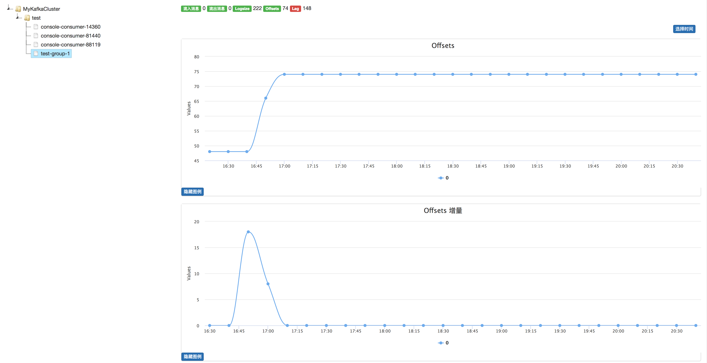
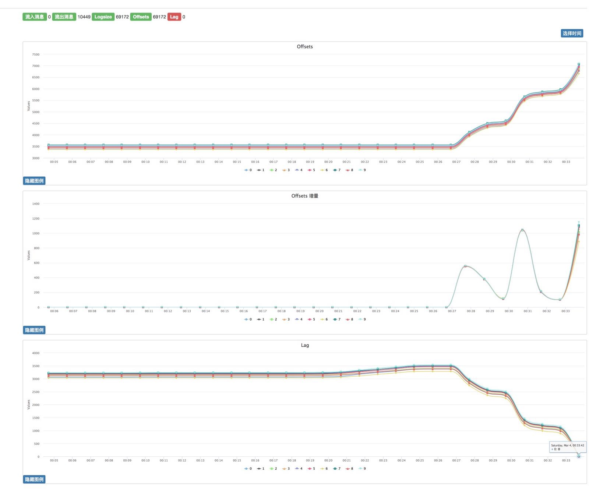
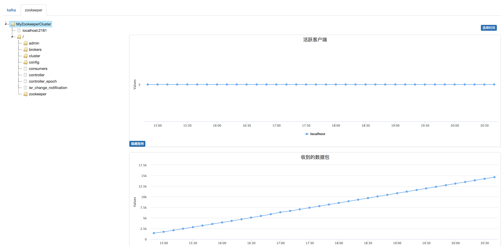
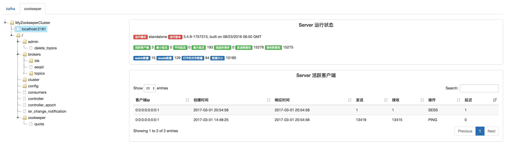

## 主要功能

### Kafka

- In/Out消息统计
- Topic增量数据排名
- Consumer延迟实时排名
- 可查看每个Topic Partition的Logsize Offsets Lag数据
- 实时获取指定Group的Logsize Offsets Lag
- 可定制的历史数据存储时间









### Zookeeper

- 集群各个节点性能数据
- 单个Server性能数据与该Server的当前活跃客户端
- 展示指定znode数据(zookeeper get操作)
- 可定制的历史数据存储时间







## Api

### Kafka

`/api/v1/kafka`

参数

- cluster
  kafka.yaml中配置的Kafka集群名称
- topic
  Kafka Topic
- group
  Consumer Group

```shell
curl "http://127.0.0.1:8080/api/v1/kafka?cluster=myCluster&topic=myTopic&group=myGroup"
```

### Zookeeper

`/api/v1/zookeeper`

参数

- cluster
- server

```shell
curl "http://127.0.0.1:8080/api/v1/zookeeper?cluster=myCluster&server=10.0.0.1"
```

## 安装配置

    cd kzmonitor; pip install -r requirements.txt

- etc/server.conf 控制数据采集间隔与存储时间等
- etc/kafka.yaml 监控Kafka集群配置
- etc/zookeeper.yaml 监控Zookeeper集群配置

## 启动

    cd kzmonitor; nohup python kzmonitor.py &> /dev/null &

## Run in Docker

### Build or pull

```
$ docker build -t kzmonitor .
```

Or

```
$ docker pull liubin/kzmonitor
```

### Edit Config files

Init config files

```
$ docker run -v `pwd`/tmp/etc:/tmp/etc --rm kzmonitor cp -r /kzmonitor/etc /tmp
```

Edit config files

```
$ vi tmp/etc/kafka.yaml
$ vi tmp/etc/zookeeper.yaml
```

### Run the kzmonitor container

```
$ mkdir -p tmp/data/{kafka,zookeeper}
$ docker run -p 8088:80 \
    -v `pwd`/tmp/etc:/kzmonitor/etc \
    -v `pwd`/tmp/data:/kzmonitor/data \
    -e PORT=8088 \
    -e USER=aster \
    -e PASS=abcde \
    kzmonitor
$ docker logs -f kzmonitor
```

Envs for basic auth:

- `PORT`: If changed in `etc/server.conf`, default is `8080`;
- `USER`: User for basic auth, default `admin`;
- `PASS`: Password for basic auth, default `567`
